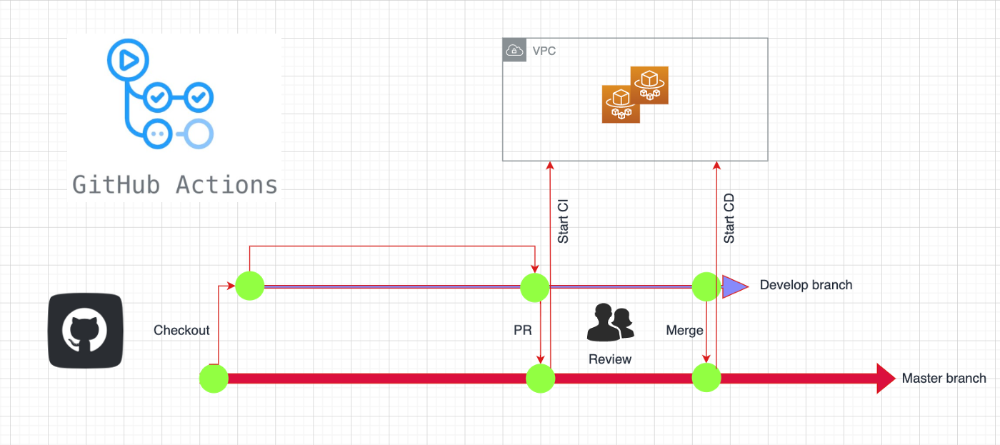

# Automatización de Terraform con GitHub Actions con self-hosted runner en AWS
En este proyecto vamos a demostrar cómo llevar a cabo un CI/CD de un proyecto de infraestructura con la ayuda de GitHub Actions y Terraform. Para ello nos vamos a servir de 	[GitHub Actions](https://github.com/features/actions).

Vamos a partir del siguiente supuesto:

1. La empresa posee varias cuentas AWS. Para el ejemplo serán sólo 2, cuenta 111111111111 y 222222222222.
2. Cuenta con un sólo self-hosted runner, el cual se encuentra levantado en la cuenta 111111111111.
3. La infraestructura será desplegada en la cuenta 222222222222. Para el ejemplo será un simple bucket S3.

## Creación del runner en la cuenta 111111111111
Se levantará una EC2 y se ejecutarán los siguientes comandos para desplegar el runner, pero primero necesitaremos un token que nos proporcionará GitHub. ëste se obtendrá en Settings > Actions > Runners. Seleccionando el S.O. viene la secuencia de comando para desplegarlo, entre los que se encuentra el token necesario.

Podemos lanzar la EC2 en la consola de AWS indicando el siguiente script user-data

```sh
#!/usr/bin/bash
useradd githubrunner
yum install jq perl-Digest-SHA git -y
mkdir actions-runner && cd actions-runner
curl -o actions-runner-linux-x64-2.288.1.tar.gz -L https://github.com/actions/runner/releases/download/v2.288.1/actions-runner-linux-x64-2.288.1.tar.gz
echo "325b89bdc1c67264ec6f4515afda4534f14a6477d9ba241da19c43f9bed2f5a6  actions-runner-linux-x64-2.288.1.tar.gz" | shasum -a 256 -c
tar xzf ./actions-runner-linux-x64-2.288.1.tar.gz
su -c "/actions-runner/config.sh --unattended --url https://github.com/toninoes/github-actions-self-hosted-runners --token ACYWX6XAKLONG7R3RYNMIGTCF5A5W --name Tonitest" githubrunner
/usr/bin/bash svc.sh install
/usr/bin/bash svc.sh start
```

## Crear y adjuntar Rol a la instancia del Runner
Creamos el rol cuyo arn será **arn:aws:iam::111111111111:role/TestRunners** y contendrá la siguiente pólitica:

```json
{
    "Version": "2012-10-17",
    "Statement": [
        {
            "Effect": "Allow",
            "Action": [
                "sts:AssumeRole",
                "sts:TagSession"
            ],
            "Resource": [
                "arn:aws:iam::111111111111:role/TestRunners",
                "arn:aws:iam::222222222222:role/TestRunners",
            ]
        }
    ]
}
```

en Relaciones de Confianza indicaremos

```json
{
    "Version": "2012-10-17",
    "Statement": [
        {
            "Sid": "TrustPolicy",
            "Effect": "Allow",
            "Principal": {
                "Service": "ec2.amazonaws.com"
            },
            "Action": [
                "sts:AssumeRole",
                "sts:TagSession"
            ]
        }
    ]
}
```

En la cuenta 222222222222 crearemos el rol **arn:aws:iam::222222222222:role/TestRunners** el cual contendrá las politicas que necesitemos para desplegar infraestructura allí, en nuestro ejemplo **AmazonS3FullAccess** y en Trust relationships indicaremos:

```json
{
    "Version": "2012-10-17",
    "Statement": [
        {
            "Sid": "TrustPolicy",
            "Effect": "Allow",
            "Principal": {
                "AWS": "arn:aws:iam::111111111111:role/TestRunners"
            },
            "Action": [
                "sts:AssumeRole",
                "sts:TagSession"
            ]
        }
    ]
}
```

## CI/CD en Terraform
Lo que pretendemos conseguir es que en cada despliegue se realice:
1. CI (Continous Integration): Crearemos una rama el cual contendrá las nuevas caracteristicas (nuevo elemento infra, modificación de un elemento existente) y tras hacer un pull request se desencadenarán las siguientes acciones:
    1. Comprobación del formato de código de Terraform
    2. Comprobación de validación de código de Terraform
    3. Plan Terraform: para ver qué cambios ocurrirán

2. CD (Continous Deployment): La rama main estará proteguida y sólo un grupo reducido de miembros del equipo tendrán la posibilidad de mergear con la rama main. Éstos, tras revisar el plan de la etapa anterior (CI), aprobarán el PR y mergearan por tanto con la rama main, la cual llevara a cabo:
    1. Terraform Apply: aplique el código y realice cambios en el entorno de la infraestructura

<center></center>
